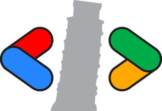

# GDG Pisa &bull; Links

[](https://app.netlify.com/sites/lambent-bunny-988790/deploys)
[](https://astro.build)
[](https://preactjs.com)
[](https://www.typescriptlang.org)

Benvenuto nel progetto GDG Pisa Links! Questo progetto è una semplice web
application che fornisce link alle varie risorse e ai social media di GDG Pisa.
È costruito con TypeScript, Astro e Preact.

## ✨ Funzionalità

- 🌓 Design responsive con supporto alla dark mode
- 🔗 Link ai social media di GDG Pisa
- 📅 Recupero e visualizzazione dinamica dell'ultimo evento GDG Pisa
- 📝 Per aggiornare i link mostrati basta modificare il file `./src/data.yaml`

## 📦 Installazione

Per iniziare, clona il repository e installa le dipendenze (con `npm` o `bun`):

```sh
$ git clone https://github.com/aziis98/gdg-pisa-linktree
$ cd gdg-pisa-linktree
$ npm install
```

## 🛠️ Sviluppo

### ▶️ Utilizzo

Per avviare il progetto in locale, usa il seguente comando:

```sh
$ npm run dev
```

Questo avvierà un server di sviluppo e potrai vedere l'applicazione nel
browser su `http://localhost:4321`.

### 🏗️ Build del progetto

Per compilare il progetto per la produzione, usa il seguente comando:

```sh
npm run build
```

Questo creerà una cartella `dist/` con la build di produzione
dell'applicazione.

## 📓 Note

- https://stackoverflow.com/questions/27844608/a-way-to-pass-url-parameters-into-survey
